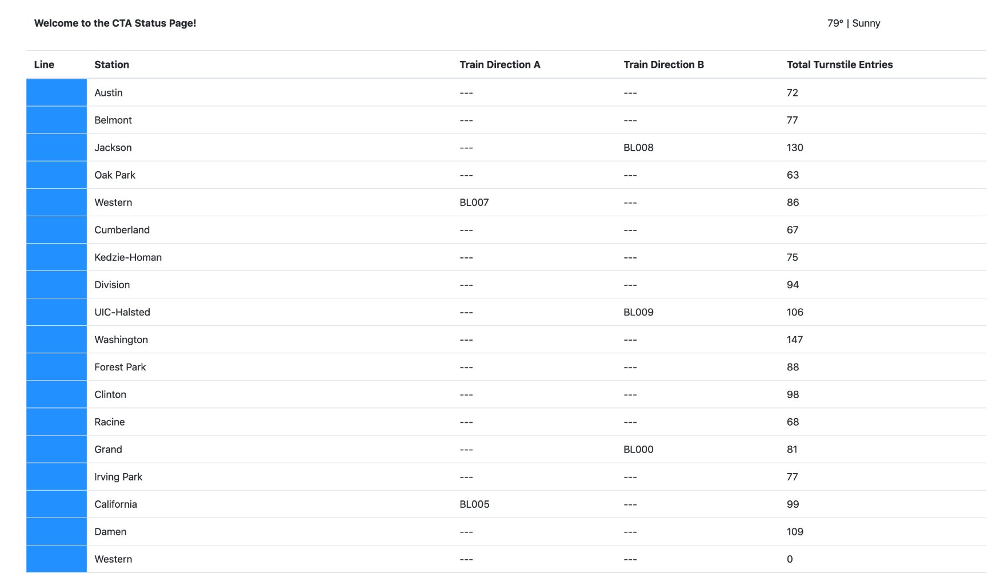
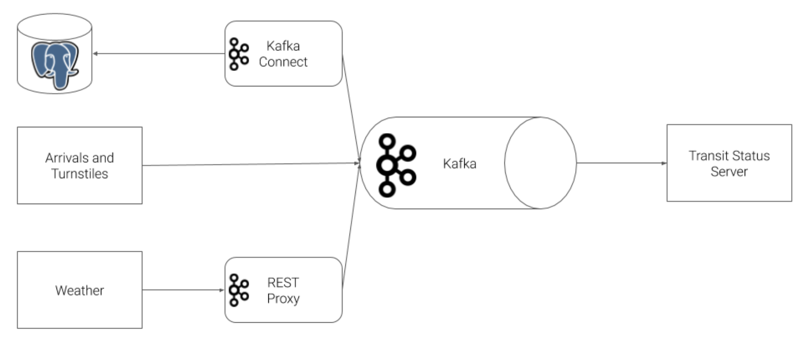
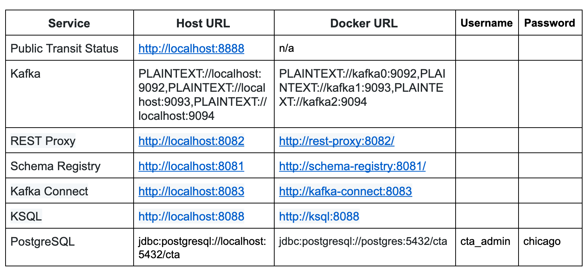

# Optimizing Public Transportation
In this project, we will construct a **streaming event pipeline** around **Apache Kafka and its ecosystem**. Using public data from the [Chicago Transit Authority](https://www.transitchicago.com/data/), we will construct an event pipeline around Kafka that allows us to simulate and display the status of train lines in real time.

When the project is complete, you will be able to monitor a website to watch trains move from station to station. So a sample static view of the website page you create might look like this:



## Prerequisites
To complete your project, the following are required:
- Docker
- Python 3.7
- Kafka ecosystem (Kafka Python Client, Kafka Connect, Schema Registry, Kafka REST Proxy, ksqlDB, Zookeeper, Kafka Connect UI, Kafka Topics UI, Schema Registry UI)
- Faust
- PostgreSQL
- A minimum of 16gb+ RAM and a 4-core CPU on your computer to execute the simulation

## Project Steps
The Chicago Transit Authority (CTA) has asked us to develop a dashboard displaying system status for its commuters. We have decided to use Kafka and ecosystem tools like REST Proxy and Kafka Connect to accomplish this task.

**Our architecture will look like so:**




### Step 1: Create Kafka Producers
The first step in our plan is to configure the train stations to emit some of the events that we need. The CTA has placed a sensor on each side of every train station that can be programmed to take an action whenever a train arrives at the station.

### Step 2: Configure Kafka REST Proxy Producer
Our partners at the CTA have asked that we also send weather readings into Kafka from their weather hardware. Unfortunately, this hardware is old and we cannot use the Python Client Library due to hardware restrictions. Instead, we are going to use HTTP REST to send the data to Kafka from the hardware using Kafka's REST Proxy.

### Step 3: Configure Kafka Connect
Finally, we need to extract station information from our PostgreSQL database into Kafka. We've decided to use the [Kafka JDBC Source Connector](https://docs.confluent.io/current/connect/kafka-connect-jdbc/source-connector/index.html).
- You can run this file directly to test your connector, rather than running the entire simulation.
- Make sure to use the [Landoop Kafka Connect UI](http://localhost:8084) and [Landoop Kafka Topics UI](http://localhost:8085) to check the status and output of the Connector
- To delete a misconfigured connector: `CURL -X DELETE localhost:8083/connectors/stations`

### Step 4: Configure the Faust Stream Processor
We will leverage Faust Stream Processing to transform the raw Stations table that we ingested from Kafka Connect. The raw format from the database has more data than we need, and the line color information is not conveniently configured. To remediate this, we're going to ingest data from our Kafka Connect topic, and transform the data.

### Step 5: Configure the KSQL Table
Next, we will use KSQL to aggregate turnstile data for each of our stations. Recall that when we produced turnstile data, we simply emitted an event, not a count. What would make this data more useful would be to summarize it by station so that downstream applications always have an up-to-date count.
- The KSQL CLI is the best place to build your queries. Try `ksql` in your workspace to enter the CLI.
- You can run this file on its own simply by running `python ksql.py`
- Made a mistake in table creation? `DROP TABLE <your_table>`. If the CLI asks you to terminate a running query, you can `TERMINATE <query_name>`

### Step 6: Create Kafka Consumers
With all of the data in Kafka, our final task is to consume the data in the web server that is going to serve the transit status pages to our commuters.


## Running and Testing
To run the simulation, you must first start up the Kafka ecosystem on your machine utilizing Docker-Compose:

`%> docker-compose up`

Docker-Compose will take 3-5 minutes to start, depending on your hardware. Please be patient and wait for the Docker-Compose logs to slow down or stop before beginning the simulation.

Once Docker-Compose is ready, the following services will be available on your local machine:



Note that to access these services from your own machine, you will always use the `Host URL` column.

When configuring services that run within Docker-Compose, like Kafka Connect, **you must use the `Docker URL`**. When you configure the JDBC Source Kafka Connector, for example, you will want to use the value from the `Docker URL` column.

### Running the Simulation
**There are mainly two pieces to the simulation**, the `producer` and `consumer`. As you develop each piece of the code, it is recommended that you only run one piece of the project at a time.

However, when you are ready to verify the end-to-end system, it is critical that you open a terminal window for each piece and run them at the same time.

**To run the `producer`:**
```
cd producers
virtualenv venv
. venv/bin/activate
pip install -r requirements.txt
python simulation.py
```

Once the simulation is running, you may hit `Ctrl+C` at any time to exit.

**To run the Faust Stream Processing Application:**
```
cd consumers
virtualenv venv
. venv/bin/activate
pip install -r requirements.txt
faust -A faust_stream worker -l info
```

**To run the KSQL Creation Script:**
```
cd consumers
virtualenv venv
. venv/bin/activate
pip install -r requirements.txt
python ksql.py
```

**To run the `consumer`:**

**Note**: Do not run the consumer until you have reached Step 6!
```
cd consumers
virtualenv venv
. venv/bin/activate
pip install -r requirements.txt
python server.py
```
Once the server is running, you may hit `Ctrl+C` at any time to exit.


## Resources
- [Confluent Python Client Documentation](https://docs.confluent.io/current/clients/confluent-kafka-python/#)
- [Confluent Python Client Usage and Examples](https://github.com/confluentinc/confluent-kafka-python#usage)
- [REST Proxy API Reference](https://docs.confluent.io/platform/current/kafka-rest/api.html)
- [Kafka Connect JDBC Source Connector Configuration Options](https://docs.confluent.io/current/connect/kafka-connect-jdbc/source-connector/source_config_options.html)
- [Faust](https://faust.readthedocs.io/en/latest/index.html)
- [KSQL](https://ksqldb.io/)
- [Avro](https://avro.apache.org/docs/1.8.2/spec.html)